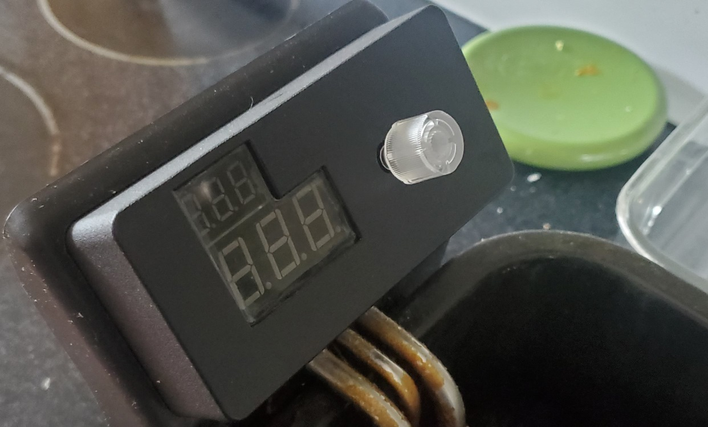

# Fryer controller

- Hardware: https://oshwlab.com/enfoldit.dafonso/fryer
- Software: https://github.com/danshardware/cholesterol-inator

## TO DO

Nothing. This version is complete.

## Issues on this board, to be fixed if there is a v2

- Having one of the LED segments on the analog banks on the Pi Pico angers the ADC. Remove it (we don't need a period)
- Forgot to add beeper, so air-wired one off a GPIO
- Running 5V via a GPIO pin for routing was stupid. I cut the trace on the Pico
- Minor error on the current source. Fixed in schematic and green-wired on the board.
- Diode should be 3.6V zener
- Filter the therimstor with 2uF, not 100nF

## Issues we're not fixing for this version

- LEDs have a lot of ghosting. Maybe figure out how to lessen that.
